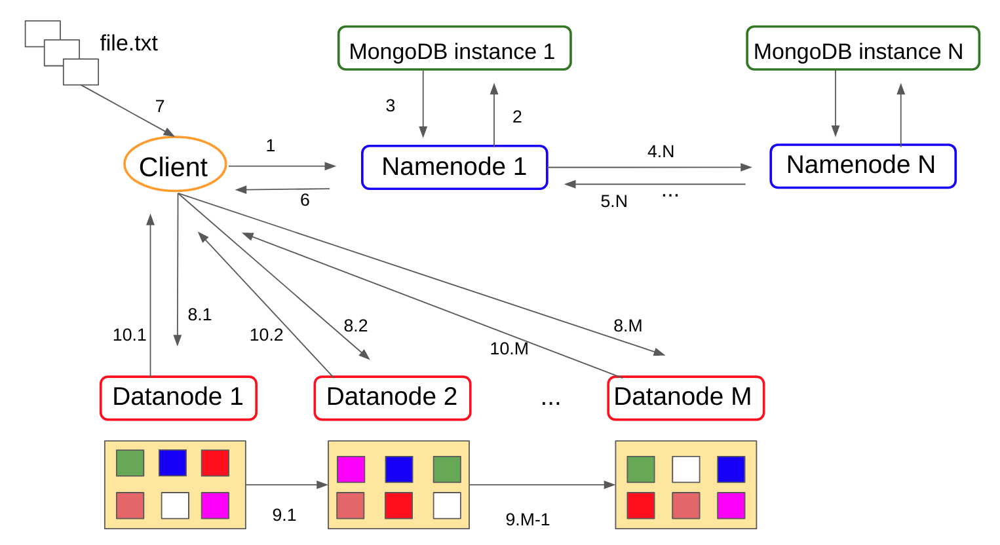

# HandMadeDistributedFileSystem

## H(M)DFS - HandMade Distributed File System

The **HandMade Distributed File System - H(M)DFS** - is a simplified implementation of a distributed file system realized by Marco Pavia that runs in a cluster of nodes and is designed to be fault-tolerant. 
The system has been implemented in **Python 3** and any machine that supports Python 3 can run the software.

## Architecture description

There are two types of nodes: 

- the **Namenodes**: they manage the file system namespace and metadata, regulate access to files and directories by clients;
- the **Datanodes**: they manage the storage, the real content of the files.

The system namespace is maintained by the Namenodes into **MongoDB** instances, inside of them there are four different collections responsible of maitaining the following information:

- **fs**: this collection handles data regarding the structure of the file system, so the directories tree info and the files info; inside this collection there are two types of documents, the files documents and the directories documents;
- **users**: this collection handles data regarding the users who have access to the H(M)DFS; inside this collection there is only a type of document, the users documents;
- **groups**: this  collection handles data regarding the groups to which the different users partecipate to (the concept besides a group is quite similar to what is a group in Linux); inside this collection there is only a type of document, the groups documents;
- **trash**: this collection handles some data used when a Datanode has recovered from a failure, we will discuss it later; inside this collection there is only a type of document, documents that register, for each failed Datanode, which are the chunks that must be deleted after recovery from disaster.

Internally a file is splitted into several **"chunks"**, which are stored inside the Datanodes; you can think of a chunk as a contiguous subset of the entire set of bytes which compose a file. Imagine to have a very huge file of M bytes; this file, when it will be loaded into the H(M)DFS, will be splitted into several small chunks, each of these of size N bytes; the total number of chunks for that file will be M/N and the first K-1 chunks will have a size of N bytes, while the last K chunk will have a size of M - [(K-1) * N] bytes. Moreover, each chunk is replicated across different Datanodes, in order to make the system fault-tolerant, and each replica of a certain chunk must be maintained by a different Datanode (in other words, a Datanode cannot maintain two replicas of the same chunk). The Datanode stores H(M)DFS data in files in its local file system and has no knowledge about H(M)DFS files; it stores each chunk of H(M)DFS data in a separate file in its local file system. The DataNode creates all files in the same directory, that can be configured.
Summarily, the Namenodes execute file system namespace operations like opening, closing, and renaming files and directories and determine the mapping of chunks to Datanodes, which are responsible for serving read and write requests from the file system client and also perform chunk creation, deletion and replication. H(M)DFS supports a traditional hierarchical file organization, with a namespace Linux-like (excluded hard links and soft links). A user of the system can create directories and store files inside these directories; it's possible to create and to remove files, to move a file from one directory to another, or to rename a file. The Namenodes maintain the file system namespace. Any change to the file system namespace or its properties is recorded by the Namenodes. The number of replicas of each chunk of a file that should be maintained can be specified as a configuration parameter, as well as the max size of each chunk. The master Namenode makes all decisions regarding replication of chunks and periodically receives a heartbeat from each of the Datanodes in the cluster; receiving a heartbeat from a Datanode implies that the DataNode is functioning properly.

The communication protocols used are:

- **WebSocket**: to ensure that the Datanodes send heartbeats to the master Namenode;
- **XML-RPC**: to ensure a client invokes the operations on the master Namenode and to ensure the master Namenode can align the namespace maintained by the other slave Namenodes;
- **HTTP REST Web Service**: to ensure the client can execute chunks creation, deletion and replication on the Namenodes.

We will discuss more in detail the communication between the different elements of the system later.
Each Datanode sends a heartbeat message to the master Namenode periodically. When the Namenode doesn't receive any heartbeat from a Datanode after a certain time interval, the Namenode marks it as down (or dead) and starts the recovery process, that is start creating new replicas for the primary or secondary chunks which were handled by the failed Datanode. When the Datanode will be recovered from the disaster, then the Namenode starts the flush process, that is start deleting from the recovered Datanode the chunks that previously were handled by it and now are handled by other Datanodes. The Datanodes send heartbeats to what they recognize as the master Namenode; if the Master Namenode goes down, then the Datanodes will choose another Namenode that becomes the new master and start to send heartbeats to this new master Namenode. The new  master is choosen using a priority list of Datanodes; the prioritization can be configured. 

## Reading process communication schema

The schema above represents a typical communication schema of what happens when a client wants to get/read a file from the H(M)DFS; during the process can be identified different phases:

- pahse 1: the client invokes a get/read command, and calls a remote procedure using XML-RPC on the master Namenode;
- pahse 2: the Namenode gets the information required for the file from the MongoDB instance on which it maintains the metadata regarding the file system namespace, executing a query; by the way, there's a series of checks regarding the permissions of the user who required the file; 
- phase 3: MongoDB provides the Namenode with the document which represents the file, inside of this there are all the information about it, e.g. the file name, the creation and update time, the parent directory and, the most important thing, which are the Datanodes that handle the primary and secondary chunks on which there is the real content of the file;
- phase 4: the Namenode provides the client with the info regarding the file needed for getting the content from the Datanodes;
- phases 5.1, ..., 5.M: the client starts some HTTP get requests using the REST web services exposed by the Namenodes for getting the chunks content; during these phases, for each chunk, the client executes a get request on the Datanode which handles the current chunk passing the file id that represents the file uniquely and the chunk sequence number; for each chunk, the first request is done on the primary Datanode handler for it and, if the primary Datanode is down, then it's started another request on the secondary Datanoted, and so on;
- phases 6.1, ..., 6.M: the Datanode gets the chunk content for the chunk required from its local file system and provides the client with the chunk content;
- phase 7 (optional): if the invocation is a file get, then the file will be rebuild using the chunks contents got sorted by the chunks sequences numbers and the file will be saved on the client local file system; instead, if the invocation is just a file read, then the file will not be saved on the client local file system, but just showed. 

## Writing process communication schema

The schema above represents a typical communication schema of what happens when a client wants to write a file to the H(M)DFS; during the process can be identified different phases:

- pahse 1: the client invokes a write command, and calls a remote procedure using XML-RPC on the master Namenode;
- pahse 2: the Namenode create the MongoDB document and chooses which are the Datanodes that handle the primary and secondary replicas of each chunk in which the file will be divided; the Namenode execute the insert of the document into MongoDB
- phase 3: MongoDB insert the document representing the file into the fs collection and provides the Namenode with unique id of the file document just inserted; 
- phases 4.1, ... 4.N: the master Namenode aligns the other Namenodes with the file info just created and invokes a XML-RPC to do it for each Namenode that is up;
- phases 5.1, ..., 5.N: the Namenodes give a feedback to the master Namenode about the alignment of their MongoDb instances;
- phases 6: the Datanode provides the client with the list of the chunks to write and the respective primary and secondary Datanodes that will handle the replicas of each chunk; 
- phase 7: the client gets the file content from the local file system;
- phases 8.1, ..., 8.M: the client starts some HTTP put requests using the REST web services exposed by the Namenodes for writing the chunks content; during these phases, for each chunk, the client executes a put request on the primary Datanode designed to handle the current chunk passing the file id that represents the file uniquely, the chunk sequence number, the chunks content and the list of the secondary Datanodes for the current chunks;
- pahses 9.1, ..., 9.M-1: for each chunk, after the primary Datanode has completed to write the chunk on the local file system, it publishes a message on a publish/subscribe system in order to start the replica writing process on the other secondary Datanodes; so the primary Datanode executes a HTTP put request on the first secondary Datanode, then the first secondary Datanode executes a HTTP put request on the second secondary Datanode and so on; 
- phases 10.1, ..., 10.M: for each chunk, the primary Datanode gives an HTTP put response for signilaing the writing process has ended. 

## Heartbeats process and recovery from failure schemas

The schema above shows the typical heartbeats communication schema; each Datanode must send an heartbeat to the current master Namenode every 2 seconds in order to demonstrate its good health; the master Namenode, when receives a heartbeat from a Datanode, will send a response to it; the protocol used for sending heartbeats and sending responses to them is the WebSocket. 

The schema above shows what happens if the master Namenode goes down; if the Datanode that has sent the heartbeat doesn't receive any response from the master Namenode (the WebSocket fails), then it waits 5 seconds before sending another heartbeat; if the WebSocket fails for 5 consecutives times, then the next Namenode with the highest priority between the other active Datanodes becomes the new master one.

The schema above shows what happens if one of the Datanodes goes down, so the recovery process from failure; the master Namenode considers a Datanode as down if it doens't receive any heartbeat from it for more than 10 seconds; now, imagine that one of the Datanode fails and the master Namenode has detected its failure; during the recovery process can be identified different phases:

- pahse 1: the master Namenodes chooses which are the new primary and secondary Datanodes which must handle the replicas of the chunks previously handled by the failed Datanode and update its MongoDB instance for the file system namespace;
- pahse 2: MongoDB update its collection and gives a feedback to the master Namenode; during this phase, also the chunks that must be deleted from the failed Datanode after it will have been restored will be registered;
- phases 3.1, ..., 3.N: the master Namenode invokes a XML-RPC in order to align the other Namenodes; 
- phases 4.1, ..., 4.N: the other Namenodes give a feedback to the master Namenode;
- phases 5.1, ..., 5.M-1: the master Namenode executes some HTTP put requests in order to write the chunks on the new primary and secondary Datanodes for each chunk handled by the failed Datanode; 
- phases 6.1, ..., 6.M-1: the Datanodes, after having written the new replicas, give a HTTP response to the master Namenode. 

The image above represents the situation after having recovered from failure. Once the failed Datanode has been restored and is up again, the chunks previously handled by it will be deleted.

## Available commands in H(M)DFS

Before starting talking about the available commands, remember that **EVERY PATH YOU USE IN H(M)DFS MUST BE ABSOLUTE**. The commands a client can invoke are the following:

- **mkdir USERNAME PATH PARENT**: command user for creating a new directory; with the option PARENT (allowed values are T and F) it's possible also to create the ancestor it they doesn't exist; example: **mkdir user /user/new/directory T**
- **touch USERNAME PATH**: command used for creating a new empty file if it doens't exists or for touching an existing directory/file; example: **touch user /user/file.txt**
- **ls USERNAME PATH**: command used for listing the content of a directory; example: **ls user /user/**
- **rm USERNAME PATH**: command used for removing a file or an empty directory; example: **rm user /user/file.txt**
- **rmr USERNAME PATH**: command used for removing a directory and its content recursively or a single file; example: **rmr user /user/directory_to_rem**
- **get_file USERNAME PATH LOCAL_FILE_PATH**: command used for getting/donloading a file from the H(M)DFS and copying it into the client local file system; example: **get_file user /user/file.txt /home/linuxuser/file.txt**
- **get_chunks USERNAME PATH**: command used for getting info about the chunks and Datanodes that handle them for a file; example: **get_chunks user /user/file.txt**
- **cat USERNAME PATH**: command used for viewing the content of a file; example: **cat user /user/file.txt**
- **head USERNAME NUMBER_OF_BYTES PATH**: command used for viewing the first N bytes of a file content; example: **head user 100 /user/file.txt**
- **tail USERNAME NUMBER_OF_BYTES PATH**: command used for viewing the last N bytes of a file content; example: **tail user 100 /user/file.txt**
- **cp USERNAME ORIG_PATH DEST_PATH**: command used for copying a file into another file (if the destination path already exists, the system raises an exception because it does not overwrite); example: **cp user /user/file.txt /user/copy.txt**
- **mv USERNAME ORIG_PATH DEST_PATH**: command used for moving or renaming a file/directory into another file/directory (if the destination path already exists, the system raises an exception because it does not overwrite); example: **mv user /user/old_name.txt /user/new_name.txt**
- **count USERNAME PATH**: command used for counting the number of files and directories inside a directory; example: **count user /user**
- **countr USERNAME PATH**: command used for counting the number of files and directories inside a directory recursively; example: **countr user /user**
- **du USERNAME PATH**: command used for calculating the disk usage (in bytes) of a directory or a file; example: **du user /user**
- **chown USERNAME PATH NEW_OWN**: command used for changing the owner of a file/directory; only the root or the owner of the file/directory can execute this command; example: **chown root /user/file.txt new_user**
- **chgrp USERNAME PATH NEW_GRP**: command used for changing the group of a file/directory; only the root or the owner of the file/directory can execute this command; example: **chgrp root /user/file.txt new_group**
- **chmod USERNAME PATH NEW_MOD**: command used for changing the permissions of a file/directory; only the root or the owner of the file/directory can execute this command; example: **chmod root /user/file.txt 777**
- **put_file USERNAME LOCAL_FILE_PATH PATH**: command used for putting/copying a file from the client local file system to the H(M)DFS; example: **put_file user /home/linuxuser/file.txt /user/file.txt**
- **mkfs USERNAME**: command used for resetting the entire H(M)DFS, all the directories and the files inside the system will be deleted; example: **mkfs root**
- **groupadd USERNAME GROUP**: command used for creating a new group in the H(M)DFS; only the root can execute this command; example: **groupadd root new_group**
- **useradd USERNAME USER PASSWORD**: command used for creating a new user in the H(M)DFS; only the root can execute this command; example: **useradd root new_user**
- **groupdel USERNAME GROUP**: command used for deleting a group from the H(M)DFS; only the root can execute this command; example: **groupdel root group_to_del**
- **userdel USERNAME USER**: command used for deleting a user from the H(M)DFS; only the root can execute this command; example: **userdel root user_to_del**
- **passwd USERNAME USER NEW_PASSWORD**: command used for changing the password of a user; only the root or the user itself can execute this command; example: **passwd user user new_password**
- **usermod USERNAME USER GROUPS{1,N} OPERATION**: comand used for adding (OPERATION = +) or removing (OPERATION = -) a user from groups; only the root can execute this command; example: **usermod root user group1 group2 group3 +**
- **status USERNAME**: command used for checking the status of the system; it gives info about Datanodes and Namenodes, telling if they are up or down. example: **status root**
    
## Initialization

The first time a user wants to start the Datanodes and the Namenodes, the MongoDB instances that handle the namespace and the metadata have not neither the database nor the collections nor the documents inside of them; so the admin must do the first initialization for all the Namenodes; to make it, the admin must run the script **first_initialization.py** from the console passing the name of the Namenode as paramert (the name of the Namenode is present in the configuration file, for example namenode1); obviously, the MongoDB instances must be running. At this point, the admin can run the Namenodes and the Datanodes on the different nodes. 
When the H(M)DFS is either initializated or reset with mkfs command, two user will be created:

- the "root" user: the admin user, who can execute every command;
- the "user" user: the default user.

Also two directories will be created, the first one is the root directory "/" and second one is the home directory "/user" for the user "user". 
Each time a new user will be added to the system, a home directory for the new user will be created.

## Installation and configuration

For installing and testing the H(M)DFS, just clone this repository and make sure you have Python3 installed for all the nodes (both the Datanodes and the Namenodes and the client) and the needed MongoDB instances installed (just for the Namenodes). The MongoDB version used for developing is the v4.2.7, while the Python3 version is the 3.7.3. Besides MongoDB and Python3, you must have other Python dependencies/modules installed (listed in the file requirements.txt). 
After having cloned the repository, you must do some configurations in the file **conf.json**; the file has the following fields:
- **datanodes**: a list of the Datanodes;
- **max_chunk_size**: the maximum size of each chunk, in bytes;
- **replica_set**: the replication factor of each chunk; e.g. 3 means a primary replica and 2 secondary replicas; make sure the replica set is at leat equal to the numebr of Datanodes available, otherwise the system goes in error; 
- **max_thread_concurrency**: the concurrency factor with whom the operations of writing/reading on the Datanodes are done;
- **datanodes_setting**: the settings of each Datanode:
  - **host**: the ip address on which the Datanode is exposed; 
  - **port**: the port on which the Datanode exposes the REST web services;
  - **storage**: the directory on which the chunks will be saved;
  - **port_gencom**: the port used for sending the heartbeats and receiving the responses from the master Namenode; 
- **namenodes**: a list of the Namenodes;
- **namenodes_setting**: the settings of each Namenode:
  - **host**: the ip address on which the Namenode is exposed;
  - **port**: the port on which the Namenode exposes the XML-RPC;
  - **port_heartbeat**: the port used for receiving the heartbeats from the Datanodes;
  - **host_metadata**: the ip address on which is exposed the MongoDB instance for this Namenode, it could be the localhost or also an instance external to the Namenode;
  - **port_metadata**: the port on which is exposed the MongoDB instance for this Namenode;
  - **priority**: the priority of the Namenode.

After having configured the system, the admin must just run first the Namenodes and then the Datanodes; 
to run a Namenode, go on the shell and type: **python3 namenode.py NAMENODE_NUMBER**; example: **python3 namenode.py namenode1**
to run a Datanode, go on the shell and type: **python3 datanode.py DATANODE_NUMBER**; example: **python3 datanode.py datanode1**
As explained previously, at the beginning there will be two users available: 

- the first one is the root, for the admin, **username**: root, **password**: root1. 
- the second one is the default user, **username**: user, **password**: user1. 

After having runned the Namenodes and the Datanodes, on a client node run the client, typing **python3 client.py**; once the client is running, you can type any command you want.
That's it, the game is done!

